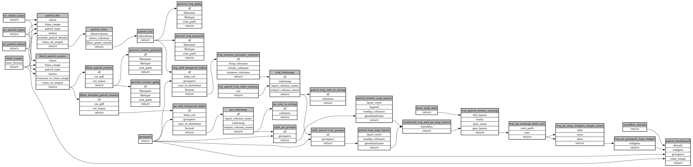

```
# AUTOGENERATED BY ECOSCOPE-WORKFLOWS; see fingerprint in README.md for details

```

```yaml
# fingerprint:
artifacts_sha256_basic: d60ee2ed964f1f1549867e67a052dc35d5cb7e987a4fec67528424fcc367dfe7
artifacts_sha256_strict: ff4a515ea801ca430c495cb7eaf3101ab2033482c7ddbbc7408580fde7e94f04
installed_requirements:
- channel: https://repo.prefix.dev/ecoscope-workflows/
  name: ecoscope-workflows-core
  version: {version: ==0.3.1}
- channel: file:///tmp/ecoscope-workflows-custom/release/artifacts/
  name: ecoscope-workflows-ext-general
  version: {version: ==9999}
params_sha256: c159e9712403636e5883ccbe998c4eebbbc88f744a8870ad90e21df4ea7e4edf
spec_sha256: 32c2c8bd5c0d04f401176c6f31209f300e9a8511ba486b6282215ffaadef881b

```

# ecoscope-workflows-patrol-events-workflow


