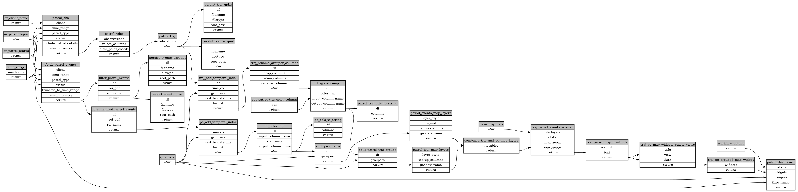

```
# AUTOGENERATED BY ECOSCOPE-WORKFLOWS; see fingerprint in README.md for details

```

```yaml
# fingerprint:
artifacts_sha256_basic: 0c8d6770133f8ae867f8ccb09bc5286ec8eb19d7b2c8e83f20b89f78a3e87faf
artifacts_sha256_strict: 6f240ca9395e4e5983043bbb47296cd9162eab20058e3179a889d3b7842d31ae
installed_requirements:
- channel: https://repo.prefix.dev/ecoscope-workflows/
  name: ecoscope-workflows-core
  version: {version: ==0.7.2}
- channel: file:///tmp/ecoscope-workflows-custom/release/artifacts/
  name: ecoscope-workflows-ext-general
  version: {version: ==9999}
params_sha256: 033e27b5657974333ccdc478ca62083f215e8f59637d33211471245d6c4c9b21
spec_sha256: 412a890eed776c0e7f1d83bbb3aaf2c79fc11a60f77217318434e0b565be9ce5

```

# ecoscope-workflows-patrol-tracks-events-workflow


