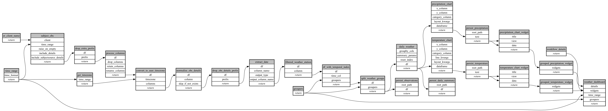

```
# AUTOGENERATED BY ECOSCOPE-WORKFLOWS; see fingerprint in README.md for details

```

```yaml
# fingerprint:
artifacts_sha256_basic: 8374d61b61343858d32aee8ae53ca01897e0599e4ad471e997f738f34605f09e
artifacts_sha256_strict: 16eebee6fc7f38f4e9e9d8e807ab661fdd47a0e217d603f786af6adc7c891153
installed_requirements:
- channel: file:///tmp/ecoscope-workflows/release/artifacts/
  name: ecoscope-workflows-core
  version: {version: ==0.19.3}
- channel: file:///tmp/ecoscope-workflows/release/artifacts/
  name: ecoscope-workflows-ext-ecoscope
  version: {version: ==0.19.3}
- channel: file:///tmp/ecoscope-workflows-custom/release/artifacts/
  name: ecoscope-workflows-ext-custom
  version: {version: ==0.0.10.dev6+g2be3b5f5e}
params_sha256: f245f6278b67f4d0412d677512c18235349fb28e6138d843932b707d927d54b2
spec_sha256: 791e0ed2a0112317a1b0166b45ebe049311328a014d9cdc45c69b2710e9bc75c

```

# ecoscope-workflows-climate-workflow


