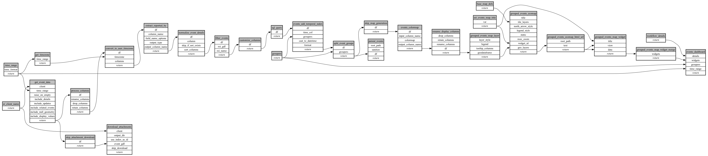

```
# AUTOGENERATED BY ECOSCOPE-WORKFLOWS; see fingerprint in README.md for details

```

```yaml
# fingerprint:
artifacts_sha256_basic: 40f1ef32db3c4719bcf8a4fe061f5a66fbe64edf29bcb3da0d1be7fb3e083a9d
artifacts_sha256_strict: f616bb1d3e282e8e05f49167b145adc25c629a5058af7da3807beab099eaa9d5
installed_requirements:
- channel: https://repo.prefix.dev/ecoscope-workflows/
  name: ecoscope-workflows-core
  version: {version: ==0.19.3}
- channel: https://repo.prefix.dev/ecoscope-workflows/
  name: ecoscope-workflows-ext-ecoscope
  version: {version: ==0.20.1.dev3+g7e8c86650}
- channel: https://repo.prefix.dev/ecoscope-workflows-custom/
  name: ecoscope-workflows-ext-custom
  version: {version: ==0.0.10}
params_sha256: 2ce2616b7d6b4cc39f4349750e8a2de102359e2185ce47e95f3fe436d77d42c9
spec_sha256: dfa90b0481f4243fd3e71b0077e30d362fed59db6472f0c0030ff4e643ff0fa7

```

# ecoscope-workflows-download-events-workflow


