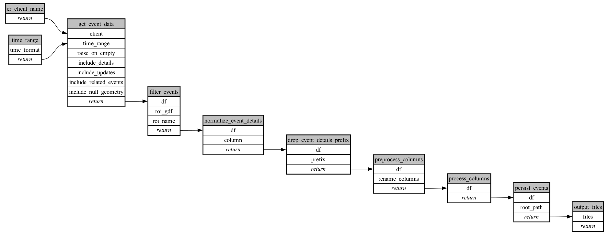

```
# AUTOGENERATED BY ECOSCOPE-WORKFLOWS; see fingerprint in README.md for details

```

```yaml
# fingerprint:
artifacts_sha256_basic: ebbeb1934fbe123062af893f8dd517c74ea051146fb8ca271faeaaf264643faa
artifacts_sha256_strict: 5c9e45dd84d0bbc56dfd9d75a3dd21d65f12a2e10ee01cc9827e7fb08d84a680
installed_requirements:
- channel: https://repo.prefix.dev/ecoscope-workflows/
  name: ecoscope-workflows-core
  version: {version: ==0.19.3}
- channel: https://repo.prefix.dev/ecoscope-workflows/
  name: ecoscope-workflows-ext-ecoscope
  version: {version: ==0.19.3}
- channel: https://repo.prefix.dev/ecoscope-workflows-custom/
  name: ecoscope-workflows-ext-custom
  version: {version: ==0.0.9}
params_sha256: cb5e6c76234d596e5c2068e628ce10ac74891b8df0e81355ddf2227ab781729a
spec_sha256: 41b189a4087f04c41b27a28bd37840c0f5ded31fd81b61d84cb36db3c7d82f05

```

# ecoscope-workflows-er-events-workflow


