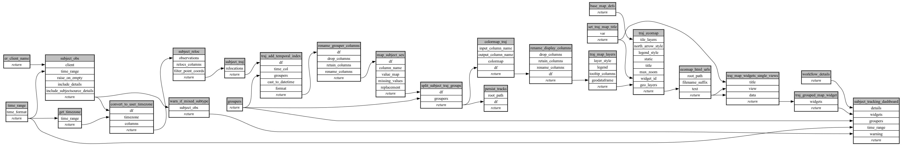

```
# AUTOGENERATED BY ECOSCOPE-WORKFLOWS; see fingerprint in README.md for details

```

```yaml
# fingerprint:
artifacts_sha256_basic: 91d4b6ec232746d95698d25b8f35b0925b107e6082ff35768cab396f59142d25
artifacts_sha256_strict: e07763aa06ba06d8e42a0d8b99848854d6161280435a25ae66eed4746e88b274
installed_requirements:
- channel: file:///tmp/ecoscope-workflows/release/artifacts/
  name: ecoscope-workflows-core
  version: {version: ==0.19.3}
- channel: file:///tmp/ecoscope-workflows/release/artifacts/
  name: ecoscope-workflows-ext-ecoscope
  version: {version: ==0.19.3}
- channel: file:///tmp/ecoscope-workflows-custom/release/artifacts/
  name: ecoscope-workflows-ext-custom
  version: {version: ==0.0.10.dev6+g2be3b5f5e}
- channel: https://repo.prefix.dev/ecoscope-workflows-custom/
  name: pydeck
  version: {version: ==0.9.1a2}
params_sha256: 27a4e685c536e317f500d6b56aad5667da7a6823136008287b1fd3beadc103a8
spec_sha256: 189b76d48d33c35cde789b9ad840f51541344d37988fdc3d3863e4afcdda635c

```

# ecoscope-workflows-download-subject-tracks-workflow


