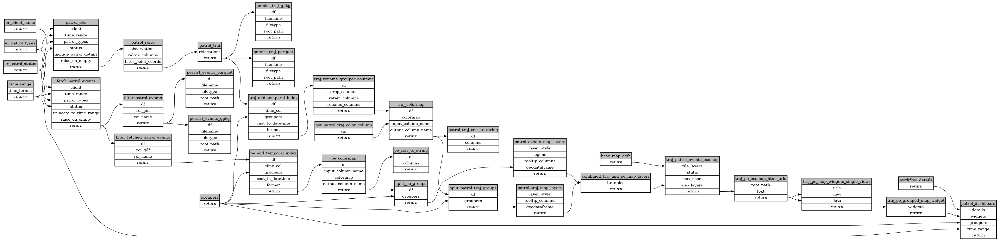

```
# AUTOGENERATED BY ECOSCOPE-WORKFLOWS; see fingerprint in README.md for details

```

```yaml
# fingerprint:
artifacts_sha256_basic: 6fca25d0730c6954ca280d5e70e97faed6d32352e47a574168c91f73f7a8e75b
artifacts_sha256_strict: 64aefc79040f754e54f76f281e6aee1d599907ba47df92d9f0c1471aac1a83e7
installed_requirements:
- channel: https://repo.prefix.dev/ecoscope-workflows/
  name: ecoscope-workflows-core
  version: {version: ==0.7.2}
- channel: file:///tmp/ecoscope-workflows-custom/release/artifacts/
  name: ecoscope-workflows-ext-general
  version: {version: ==0.0.3.dev5+g19f44beae.d20250902}
params_sha256: 6d33a6e6c30226e6615dc30fbf93b233b595c90168416e0e61f15f99c9f32288
spec_sha256: 705543d16d70e9524f09cb613da50655b6b181d836b9f57e07d4b1eff97a32d3

```

# ecoscope-workflows-patrol-tracks-events-workflow


