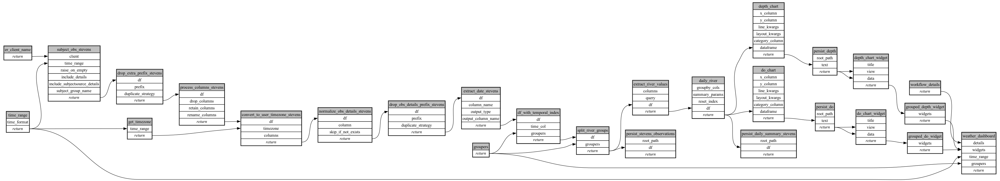

```
# AUTOGENERATED BY ECOSCOPE-WORKFLOWS; see fingerprint in README.md for details

```

```yaml
# fingerprint:
artifacts_sha256_basic: bd1bc539467cee3d8257addf6e44feb8fe9a4ec4db1c5ee3ff7ccdf50ef029f0
artifacts_sha256_strict: 9eae4de3e073683c39eaa86b8cc09b2b06928c7b3189233008b41a2074e1faf1
installed_requirements:
- channel: file:///tmp/ecoscope-workflows/release/artifacts/
  name: ecoscope-workflows-core
  version: {version: ==0.19.3}
- channel: file:///tmp/ecoscope-workflows/release/artifacts/
  name: ecoscope-workflows-ext-ecoscope
  version: {version: ==0.19.3}
- channel: file:///tmp/ecoscope-workflows-custom/release/artifacts/
  name: ecoscope-workflows-ext-custom
  version: {version: ==0.0.10.dev6+g2be3b5f5e}
params_sha256: 98b7ca08f2093ea2940e51664771e3b0dd2dc23a243cd588fbef83c6a230c9bd
spec_sha256: 73c6972a2c16e81a33b00c7c3c3180d6786088c52c613d0f0832644aaf5c603f

```

# ecoscope-workflows-river-health-workflow


