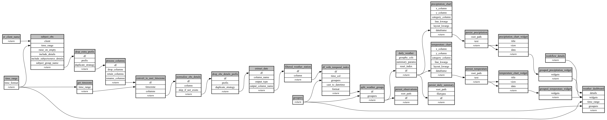

```
# AUTOGENERATED BY ECOSCOPE-WORKFLOWS; see fingerprint in README.md for details

```

```yaml
# fingerprint:
artifacts_sha256_basic: d0a9fadf033d44524c11546f1b0a9b6bd929eebdd60d61d8aa9306c6ef3a5f69
artifacts_sha256_strict: 7138285a434f9f69ef3d62021449227a72493641ad716e0027f435fce509a413
installed_requirements:
- channel: https://repo.prefix.dev/ecoscope-workflows/
  name: ecoscope-workflows-core
  version: {version: ==0.19.4}
- channel: https://repo.prefix.dev/ecoscope-workflows/
  name: ecoscope-workflows-ext-ecoscope
  version: {version: ==0.19.4}
- channel: https://repo.prefix.dev/ecoscope-workflows-custom/
  name: ecoscope-workflows-ext-custom
  version: {version: ==0.0.10}
params_sha256: 8faf9c49b224143b754646e04f61c6e387790451f8bd88505c2ffd2fc8518227
spec_sha256: 84d2a507c76dd129cda9a018ddc82deb017f6f0035df015b42f479250b2adce6

```

# ecoscope-workflows-weather-workflow


